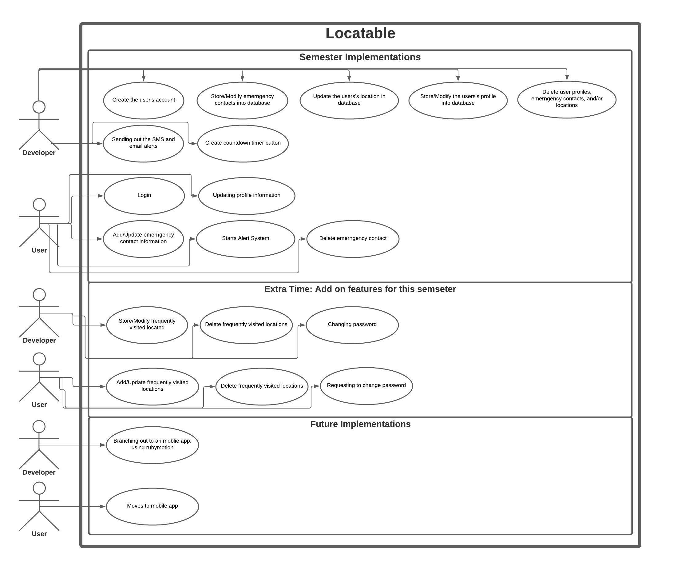
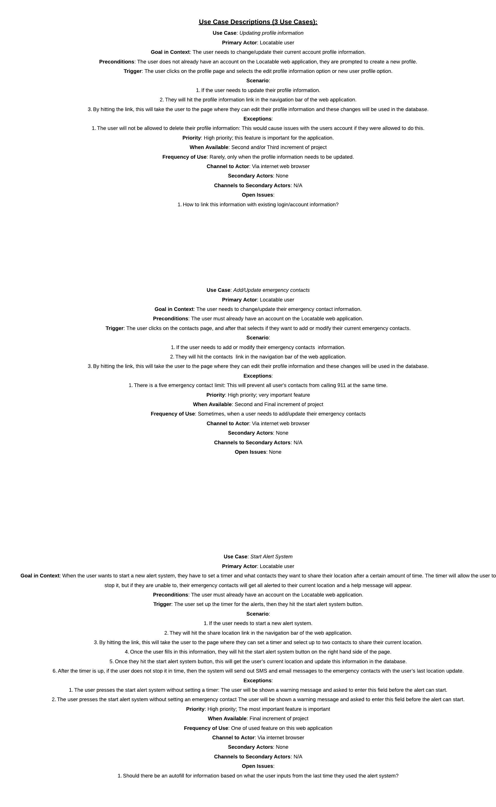
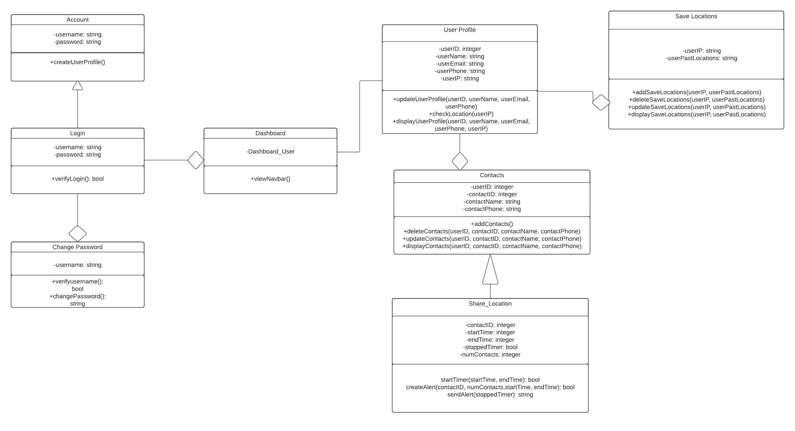
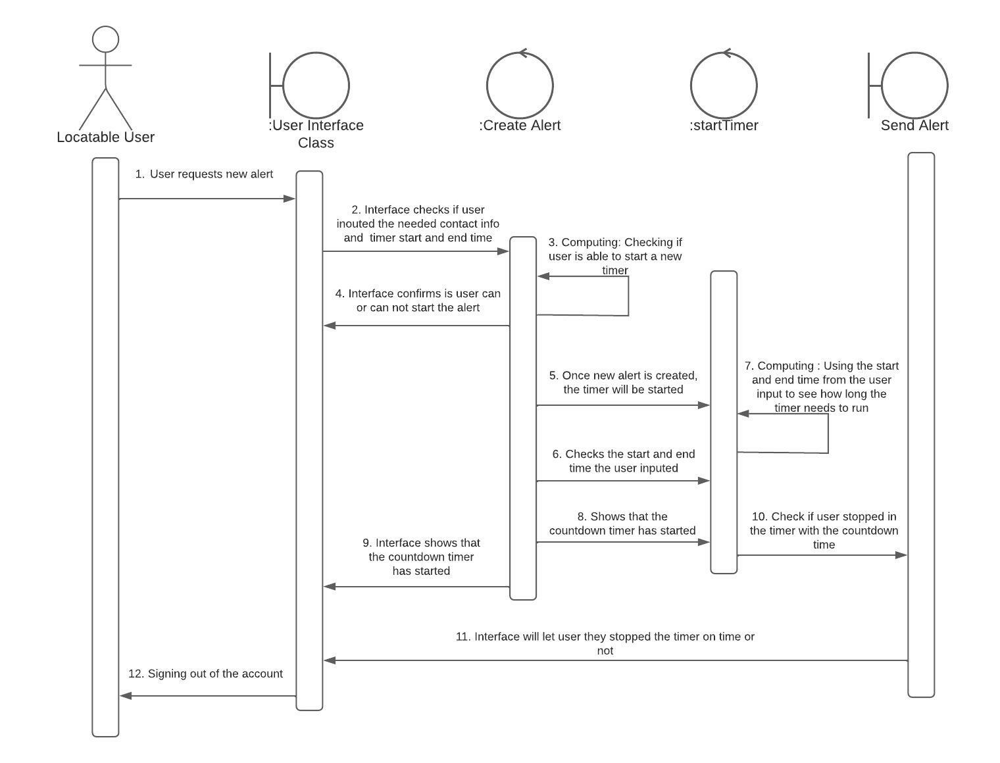
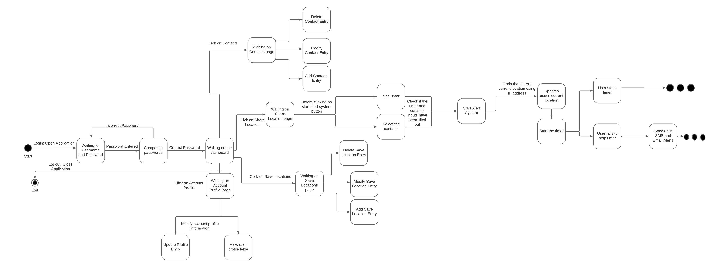

### README

### What is Locatable?
A web-based application that allows the user to send their location to their emergency contacts and this sends an SMS and email notification.

### ISSUE WITH NAV BAR:
Paths for the 3 data tables pages:
Contacts: http://csc415-server16.hpc.tcnj.edu:3000/contacts
User Profile: http://csc415-server16.hpc.tcnj.edu:3000/user_profiles
Save Location: http://csc415-server16.hpc.tcnj.edu:3000/user_locations

## Explanation of what aspect of the project is innovative, and why:
This problem is innovative because it offers older users the privacy they need instead of using the locator 
app where parental unit/emergency contacts will not know your very step, this offers people a way to let 
their emergency contact if they feel a bit unsafe and uncertain of their safety they can get an alert sent out. The 
current apps, whether they are mobile and or web-based apps, they have features of alerting the user’s emergency 
contacts about where they are at all times, or to get help from local authorities, however many of 
these features cost money and are required for some sort of monthly subscription. Safety is a basic human right,
No one should be afraid of not being able to go back home, and for that reason the Locatable web-based app 
will be free to its users and not store/sell the users sensitive information.

## Use Case for the project:

## Use_Case_Descriptions for the project:

## Design_Class_Diagram for the project:

## System Sequence Diagram for the project:

## State Chart for the project:

